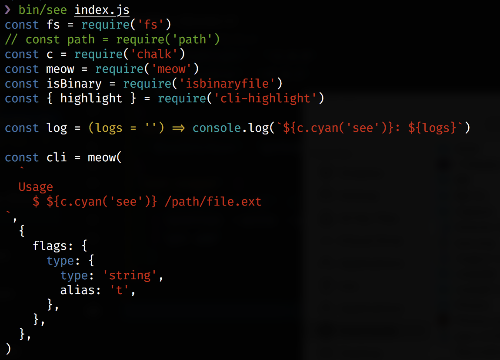
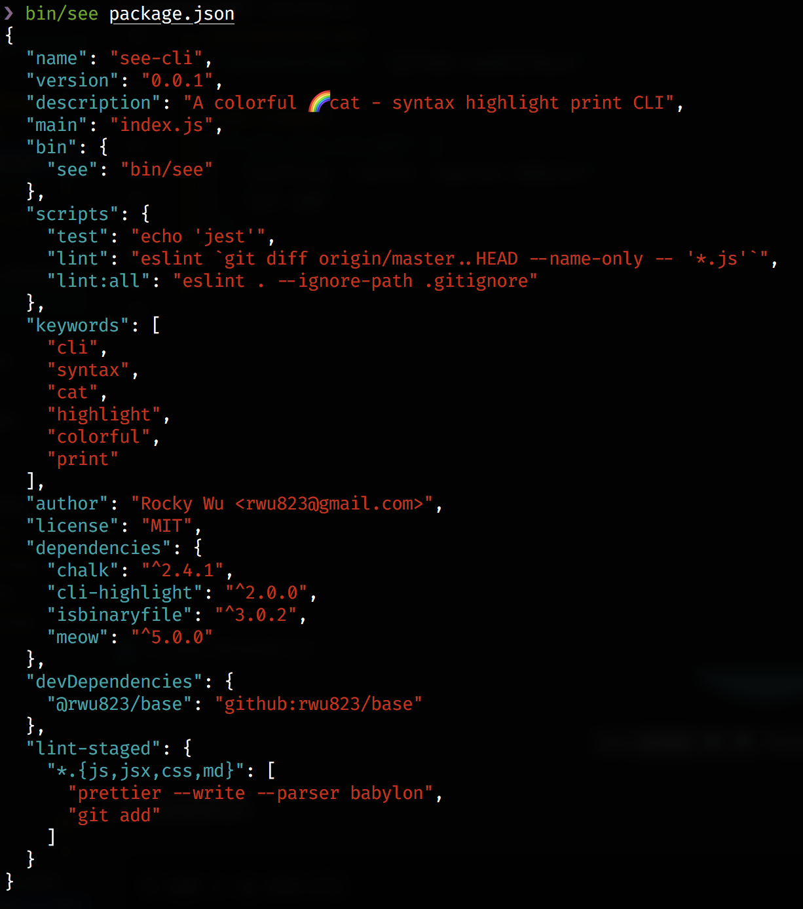

<p align="center">
  
</p>
<p align="center">
  <a href="https://www.npmjs.com/package/see-cli">
    
  </a>
  <a href="https://circleci.com/gh/rwu823/see-cli" alt="Build Status">
    
  </a>
  <a href="https://codecov.io/gh/rwu823/see-cli" alt="Coverage">
    
  </a>
</p>

## Installation

```sh
$ npm i -g see-cli
```

## Usage

```sh
$ see --help
```

## Screenshots




